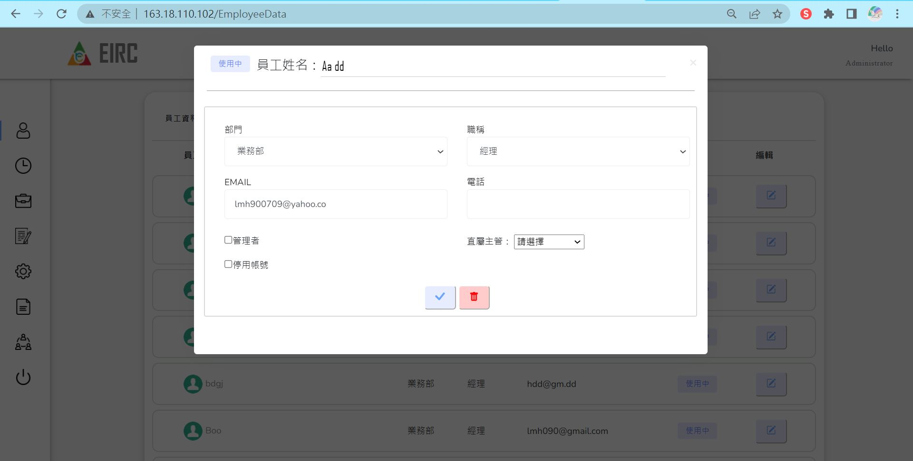
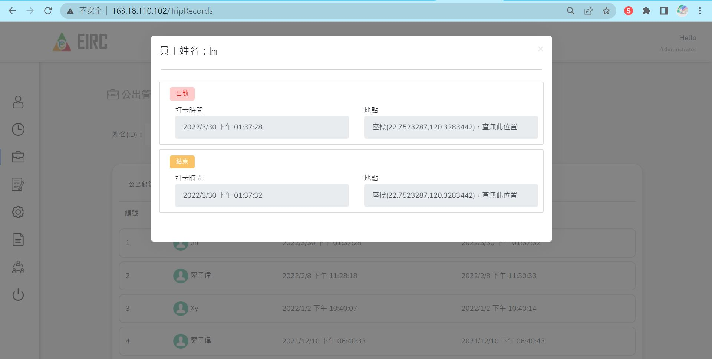
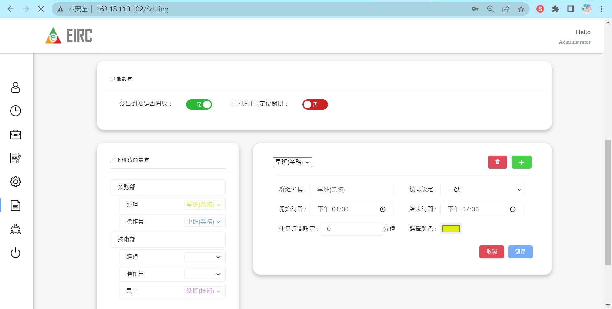

# People_errand_web

### 登入畫面

### 員工管理

* 可於「待審核-員工帳號」審核APP申請之員工帳號，可在審核同時指定員工部門、職稱、是否為管理員、指定直屬主管，審核完成會同時發送Email通知員工
* 可於中間搜尋區塊進行篩選，篩選特定員工資料

* 下方為「員工資料」列表

* 點擊編輯可查看員工詳細資料，也可進行修改

### 打卡紀錄

* 可篩選員工的打卡紀錄，也可查看員工的打卡情形

### 公出管理

* 可篩選員工的公出紀錄，也可查看員工的公出情形，點擊資料列可查看員工的公出時間及地點

### 請假紀錄

* 可於「待審核-請假申請」審核員工提出之申請，可給予同意或拒絕之選項，審核完成會同時發送Email通知員工

* 可於中間搜尋區塊進行篩選，篩選特定員工請假紀錄

* 點擊編輯可修改員工請假之審核結果，修改完成會同時發送Email通知員工

### 系統設定

* 可更改部門設定、職稱設定、公司打卡位置設定，管理員也可於此處修改密碼

* 另提供其他設定，上下班時間設定

### 權限設定

* 可更改每個職稱套用至哪個群組權限

* 可新增或修改群組

### 組織圖

* 可查看公司內部的階層關係
